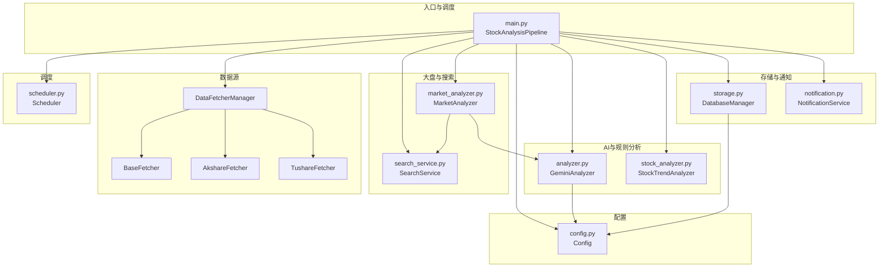
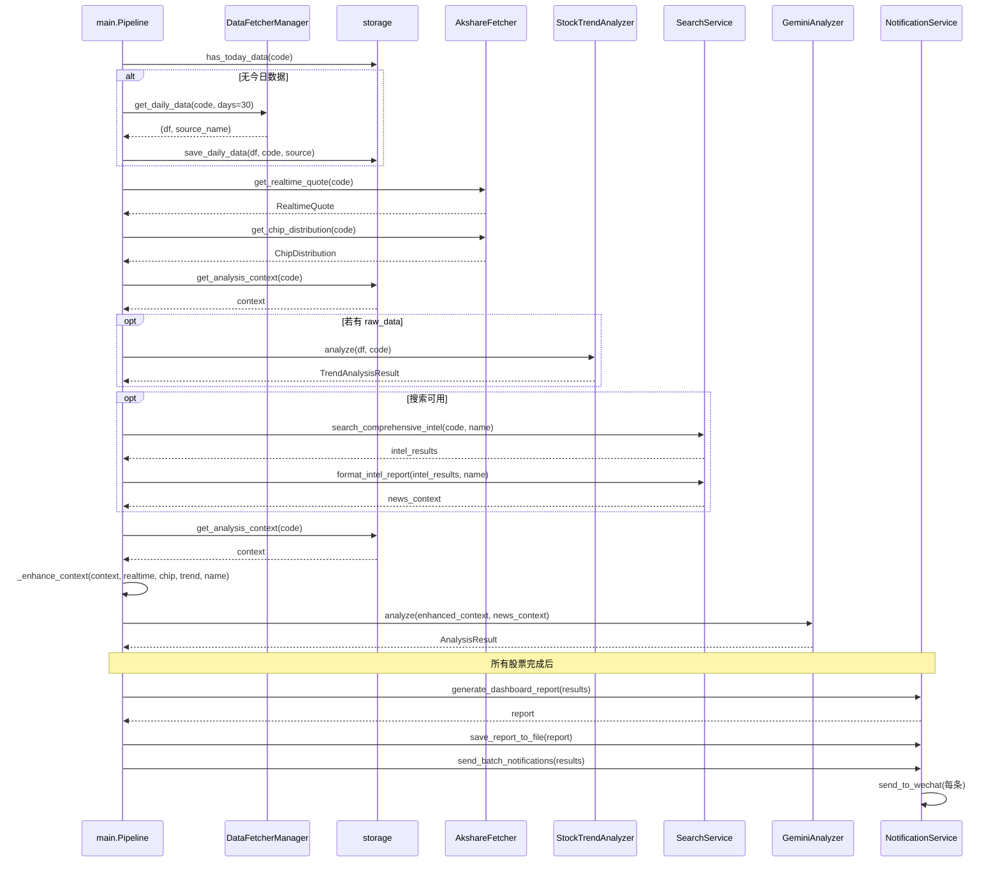
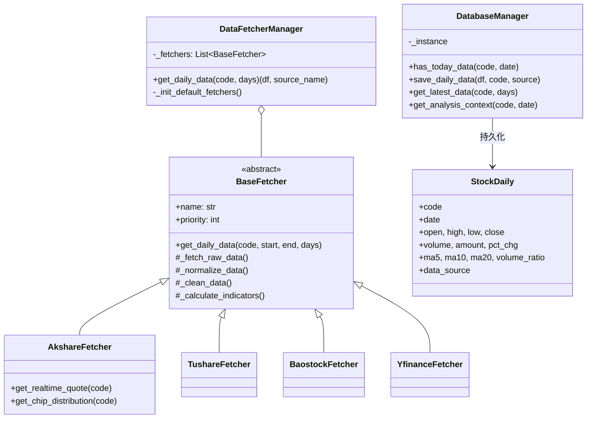
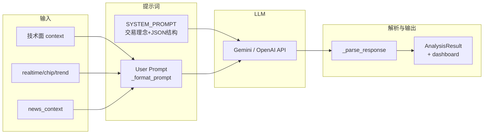

# A股/港股智能分析系统 - 技术分析文档

本文档从目录划分、架构、提示词系统、模块实现与关联、港股支持与南向资金、新人开发指南、UML 图等方面对项目进行完整分析。

---

## 目录

```
daily_stock_analysis/
├── main.py                 # 主程序入口，流程调度
├── config.py               # 配置管理（单例，.env）
├── analyzer.py              # AI 分析层（Gemini/OpenAI，决策仪表盘提示词）
├── stock_analyzer.py        # 趋势分析器（MA/乖离率/量能，规则引擎）
├── market_analyzer.py       # 大盘复盘（指数/板块/北向/南向/港股指数/新闻 + LLM 报告）
├── search_service.py       # 新闻搜索服务（Tavily/SerpAPI，多维度情报）
├── notification.py         # 消息推送（企业微信、决策仪表盘报告生成）
├── storage.py               # 存储层（SQLite，日线数据与分析上下文）
├── scheduler.py             # 定时任务（每日定点执行、优雅退出）
├── data_provider/           # 数据源策略层
│   ├── __init__.py         # 导出 BaseFetcher, DataFetcherManager, 各 Fetcher
│   ├── base.py             # BaseFetcher 抽象基类、DataFetcherManager 故障切换
│   ├── akshare_fetcher.py   # AkShare（A股/港股日线 + 实时行情 + A股筹码；港股无筹码）
│   ├── tushare_fetcher.py   # Tushare Pro
│   ├── baostock_fetcher.py  # Baostock
│   └── yfinance_fetcher.py  # YFinance
├── .github/workflows/       # GitHub Actions 每日分析
├── Dockerfile
├── docker-compose.yml
├── requirements.txt
├── .env.example
├── data/                    # SQLite 数据库目录
├── logs/                    # 日志目录
└── sources/                 # 静态资源（示例图等）
```

---

## 架构

整体为**分层 + 策略/管道**结构：

| 层次 | 职责 | 主要模块 |
|------|------|----------|
| **入口与调度** | 命令行解析、流程编排、并发控制、异常隔离 | `main.py`（StockAnalysisPipeline） |
| **配置** | 单例配置、环境变量、校验 | `config.py`（Config） |
| **AI 分析** | 大模型调用、决策仪表盘提示词、结果解析 | `analyzer.py`（GeminiAnalyzer） |
| **规则分析** | 趋势/均线/乖离率/量能/买点信号 | `stock_analyzer.py`（StockTrendAnalyzer） |
| **大盘复盘** | 指数/板块/北向/南向/港股指数/新闻 + LLM 生成复盘报告 | `market_analyzer.py`（MarketAnalyzer） |
| **搜索** | 多引擎、多维度情报、负载均衡 | `search_service.py`（SearchService） |
| **通知** | 企业微信推送、决策仪表盘报告生成与落盘 | `notification.py`（NotificationService） |
| **存储** | SQLite ORM、日线存取、分析上下文、断点续传 | `storage.py`（DatabaseManager） |
| **调度** | 每日定时、信号处理、立即执行一次 | `scheduler.py`（Scheduler） |
| **数据源** | 多数据源策略、故障切换、日线标准化 | `data_provider/`（BaseFetcher + Manager） |

**设计要点**：

- **策略模式**：数据源（BaseFetcher）、搜索引擎（BaseSearchProvider）可插拔、可扩展。
- **单例**：Config、DatabaseManager 全局唯一。
- **管道式流程**：单只股票为「拉数据 → 存库 → 实时/筹码/趋势 → 搜索 → 组上下文 → AI 分析 → 汇总通知」。
- **低并发**：线程池 `max_workers` 默认 3，配合请求间隔与随机休眠，降低被封风险。

---

## 提示词系统介绍

项目中有两套与 LLM 相关的提示词：**个股决策仪表盘**（analyzer）和**大盘复盘**（market_analyzer）。

### 1. 个股决策仪表盘（analyzer.py）

- **角色**：`SYSTEM_PROMPT` 定义「专注趋势交易的 A 股/港股投资分析师」，输出为**决策仪表盘**。港股标的（5 位代码如 00700）无筹码数据时以趋势与量价、南向资金环境为主。
- **交易理念（硬约束）**：
  - **严进**：乖离率 (现价-MA5)/MA5 > 5% 不买，直接观望。
  - **趋势**：多头排列 MA5 > MA10 > MA20。
  - **效率**：A 股关注筹码 90% 集中度、获利比例；港股若无筹码数据则以量价与南向资金替代。
  - **买点**：缩量回踩 MA5/MA10 支撑为佳。
  - **风险**：减持、业绩变脸、监管、解禁等必须体现；港股需关注南向资金、汇率、恒生科技情绪。
- **输出结构**：要求模型输出**严格 JSON**，包含：
  - `sentiment_score`、`trend_prediction`、`operation_advice`、`confidence_level`
  - `dashboard`：`core_conclusion`（一句话结论、信号类型、空仓/持仓建议）、`data_perspective`（趋势/价格/量能/筹码）、`intelligence`（新闻/风险/利好/业绩预期）、`battle_plan`（狙击点位、仓位、检查清单 ✅⚠️❌）
  - 以及 `trend_analysis`、`technical_analysis`、`news_summary` 等长文本字段。
- **用户 Prompt 组成**（`_format_prompt`）：
  - 基础信息：代码、名称、日期。
  - 技术面：今收/开高低、涨跌幅、量额、均线、均线形态。
  - 实时增强：当前价、量比、换手率、PE/PB、市值、60 日涨跌。
  - 筹码：获利比例、平均成本、集中度、筹码状态。
  - 趋势预判：趋势分析器给出的趋势状态、乖离率、量能、系统信号与理由/风险。
  - 舆情：`search_service` 多维度情报格式化后的文本。
  - 结尾：明确 5 个必须回答的问题 + 决策仪表盘输出要求。

解析时先抠出 JSON 块，再做 `_fix_json_string` 清洗、`_parse_response` 填满 `AnalysisResult`；若 JSON 失败则走 `_parse_text_response` 做简单关键词情绪兜底。

### 2. 大盘复盘（market_analyzer.py）

- **角色**：`_build_review_prompt` 中定义为「专业 A 股与港股市场分析师」，根据当日市场数据生成**纯 Markdown 复盘报告**（涵盖 A 股与港股/恒生科技、北向与南向资金）。
- **输入**：`MarketOverview`（日期、主要指数、涨跌家数、涨停跌停、成交额、北向、南向、港股指数、领涨领跌板块）+ 搜索得到的市场新闻列表。
- **格式约束**：纯 Markdown、禁止 JSON/代码块、emoji 仅标题少量使用。
- **输出模板**：  
  「📊 日期 大盘复盘」→ 一、市场总结 → 二、指数点评 → 三、资金动向（含北向/南向）→ 四、热点解读 → 五、后市展望 → 六、风险提示。
- **调用方式**：若配置了 `analyzer` 且可用，则用其 `_model.generate_content` 或 `_call_openai_api` 生成；否则退回 `_generate_template_review` 模板报告。

两套提示词共同点：都强调**结构化输出**（仪表盘 JSON / 复盘 Markdown 小节），并约束风格与风险提示。

---

## 港股支持说明

系统支持 **A 股与港股** 统一管道分析，数据与复盘均覆盖港股相关维度。

### 港股代码约定

- **代码格式**：5 位数字为港股（如 `00700` 腾讯、`09988` 阿里），6 位为 A 股；带 `.HK` 后缀会自动识别为港股。
- **配置**：在 `STOCK_LIST` 中直接加入港股代码即可，例如：`600519,00700,09988`。

### 数据层（data_provider/akshare_fetcher.py）

| 能力       | A股 | 港股 |
|------------|-----|------|
| 日线       | `stock_zh_a_hist` | `stock_hk_hist` |
| 实时行情   | `stock_zh_a_spot_em` | `stock_hk_spot_em` |
| 筹码分布   | `stock_cyq_em` | 暂不支持（返回 None，分析以趋势与量价为主） |

- **市场判定**：`AkshareFetcher.is_hk(code)` 为 True 时走港股接口，存储与 pipeline 与 A 股共用（按 `code` 区分）。

### 大盘复盘（market_analyzer.py）

- **南向资金**：`stock_hsgt_north_net_flow_in_em(symbol="南下")`，写入 `MarketOverview.south_flow`（亿元）。
- **港股指数**：若 akshare 提供 `stock_hk_index_spot_em`，则拉取恒生科技、恒生指数等填入 `overview.hk_indices`；否则跳过。
- **复盘提示词**：要求模型同时解读 A 股指数、港股指数（恒生科技等）、北向资金与南向资金；搜索增加「港股 恒生科技 南向资金」等 query。

### 提示词与推送

- **analyzer**：SYSTEM_PROMPT 中区分 A 股/港股（港股无涨跌停、可能无筹码，需关注南向资金与恒生科技环境）。
- **notification**：若分析结果中包含港股代码（5 位数字），日报标题显示为「A股/港股自选股智能分析报告」，推送内容与 A 股一致（决策仪表盘 + 单条推送）。

### 信息面与恒生科技

- 情报搜索按股票代码与名称进行，港股个股会按名称搜索；大盘复盘会搜索「港股 恒生科技 南向资金」等，信息面覆盖港股与南向资金。

---

## 各个模块的具体实现

### main.py（入口与管道）

- **职责**：解析命令行（`--debug/--dry-run/--stocks/--no-notify/--schedule/--market-review/--no-market-review`），初始化日志，校验配置，选择运行模式。
- **StockAnalysisPipeline**：
  - 依赖：Config、DatabaseManager、DataFetcherManager、AkshareFetcher（实时+筹码）、StockTrendAnalyzer、GeminiAnalyzer、NotificationService、SearchService。
  - `fetch_and_save_stock_data(code)`：先 `db.has_today_data(code)` 断点续传；否则 `fetcher_manager.get_daily_data(code, days=30)`，再 `db.save_daily_data(...)`。
  - `analyze_stock(code)`：取实时行情与筹码（Akshare）→ 从 DB 取 context，若有 `raw_data` 则做趋势分析 → 若搜索可用则 `search_comprehensive_intel` + `format_intel_report` → 再次 `get_analysis_context`，`_enhance_context` 加入 realtime/chip/trend_analysis/stock_name → `analyzer.analyze(enhanced_context, news_context)`。
  - `process_single_stock(code)`：先拉存数据，再（非 dry-run）分析，单股异常不波及其他。
  - `run(stock_codes, dry_run, send_notification)`：线程池并发 `process_single_stock`，收集 `AnalysisResult`，若需通知则 `_send_notifications`（生成仪表盘报告、落盘、企业微信分条发送）。
- **模式**：仅大盘复盘（`--market-review`）；定时（`--schedule` 或配置）调用 `run_with_schedule(run_full_analysis)`；否则单次 `run_full_analysis`（个股 + 可选大盘复盘）。

### config.py

- **Config**：dataclass，从 `.env` 加载（`_load_from_env`），单例 `get_instance()`。
- 项：stock_list、tushare_token、gemini/openai 相关、tavily/serpapi keys、wechat_webhook_url、database_path、log_dir、max_workers、schedule_enabled、schedule_time、market_review_enabled、akshare/tushare 流控与重试等。
- `validate()` 返回缺失/建议列表；`get_db_url()` 返回 SQLite URL 并确保目录存在。

### analyzer.py

- **AnalysisResult**：dataclass，含 code/name、sentiment_score、trend_prediction、operation_advice、confidence_level、dashboard（含 core_conclusion/battle_plan/intelligence 等）、多段分析文本、raw_response、success/error_message；提供 `get_core_conclusion`、`get_sniper_points`、`get_checklist`、`get_emoji` 等。
- **GeminiAnalyzer**：  
  - 初始化：优先 Gemini（主/备选模型），失败或未配置则 OpenAI 兼容 API。  
  - `analyze(context, news_context)`：请求前延时 → 组 prompt（`_format_prompt`）→ `_call_api_with_retry`（重试 + 限流时切备选模型/Gemini 失败切 OpenAI）→ `_parse_response` 解析 JSON 填 AnalysisResult。
- **STOCK_NAME_MAP**：常见代码到名称的兜底映射。

### stock_analyzer.py

- **枚举**：TrendStatus（强势多头/多头/弱势多头/盘整/空头等）、VolumeStatus（放量上涨下跌、缩量上涨回调、正常）、BuySignal（强烈买入～强烈卖出）。
- **TrendAnalysisResult**：code、趋势状态、均线排列描述、趋势强度、MA5/10/20/60、现价、乖离率、量能状态、支撑/压力、buy_signal、signal_score、signal_reasons、risk_factors。
- **StockTrendAnalyzer**：  
  - `analyze(df, code)`：计算 MA、取最新一行 → 趋势判断（均线排列与强度）→ 乖离率 → 量能（5 日均量比）→ 支撑压力（MA5/10/20 与近期高低）→ `_generate_signal` 综合打分（趋势 40 + 乖离 30 + 量能 20 + 支撑 10），输出信号与理由/风险。  
  - 参数：BIAS_THRESHOLD=5%、缩量/放量比例、MA 支撑容忍度。

### market_analyzer.py

- **MarketIndex / MarketOverview**：指数与市场概览数据结构。
- **MarketAnalyzer**：  
  - `get_market_overview()`：ak 取指数 spot、全 A spot（涨跌/涨跌停）、行业板块排名、北向净流入，填 MarketOverview。  
  - `search_market_news()`：多查询调用 `search_service.search_stock_news`（stock_code="market"）。  
  - `generate_market_review(overview, news)`：有 analyzer 则 `_build_review_prompt` + LLM 生成，否则 `_generate_template_review`。  
  - `run_daily_review()`：get_market_overview → search_market_news → generate_market_review，返回报告文本。

### search_service.py

- **SearchResult / SearchResponse**：单条结果与一次搜索响应，`to_context(max_results)` 供 AI 用。
- **BaseSearchProvider**：多 Key 轮询、错误计数与跳过、`_do_search` 抽象。
- **TavilySearchProvider / SerpApiSearchProvider**：实现 `_do_search`。
- **SearchService**：持有 tavily/serpapi 的 provider 列表，`search(query, max_results)` 按序尝试；`search_stock_news(stock_code, stock_name, ...)` 封装股票相关查询；`search_comprehensive_intel(stock_code, stock_name, max_searches)` 执行多维度（最新消息、风险排查、业绩预期等）并返回 Dict[维度名, SearchResponse]；`format_intel_report` 将多维度结果格式化为一段给 LLM 的文本。

### notification.py

- **NotificationService**：  
  - 企业微信：`send_to_wechat(content)` 使用配置的 webhook 发送 Markdown/文本。  
  - 决策仪表盘：`generate_dashboard_report(results, report_date)` 根据 AnalysisResult 列表生成带核心结论、狙击点位、检查清单、风险等内容的报告文本。  
  - `save_report_to_file(content, filename)` 写入文件；`send_batch_notifications(results)` 先发汇总再按条发单股（适配企业微信长度与格式）。

### storage.py

- **StockDaily**：ORM 表 stock_daily，字段 code/date/open/high/low/close/volume/amount/pct_chg、ma5/10/20、volume_ratio、data_source、created_at/updated_at；唯一约束 (code, date)。
- **DatabaseManager**：单例，SQLite 引擎 + sessionmaker。  
  - `has_today_data(code, target_date)`：按 code+date 查存在。  
  - `save_daily_data(df, code, data_source)`：按 code+date UPSERT，计算并写入 ma/volume_ratio，返回写入条数。  
  - `get_latest_data(code, days)`：按日期降序取最近 N 条。  
  - `get_analysis_context(code, target_date)`：最近 2 条 → 今日/昨日 dict、volume_change_ratio、price_change_ratio、`_analyze_ma_status` 的 ma_status；**不包含** raw_data（趋势分析若需历史 K 线需另从 DB 取多日或由上层拼装）。  

### scheduler.py

- **GracefulShutdown**：注册 SIGINT/SIGTERM，置位 `should_shutdown`。
- **Scheduler**：用 `schedule` 库 `every().day.at(schedule_time).do(_safe_run_task)`，可 `run_immediately` 执行一次；`run()` 循环 `run_pending()` + sleep(30)，直到 `should_shutdown`。
- **run_with_schedule(task, schedule_time, run_immediately)**：创建 Scheduler、set_daily_task、run()。

### data_provider/base.py 与 data_provider/*.py

- **BaseFetcher**：抽象 `_fetch_raw_data`、`_normalize_data`；`get_daily_data(stock_code, start_date, end_date, days)` 内部：算日期 → _fetch_raw_data → _normalize_data → _clean_data → _calculate_indicators（MA5/10/20、volume_ratio），列名统一为 STANDARD_COLUMNS。
- **DataFetcherManager**：维护 Fetcher 列表（按 priority），`get_daily_data(code, days=30)` 依次尝试，成功即返回 (df, source_name)，全失败抛异常。
- **AkshareFetcher**：除日线外，提供实时行情（量比、换手率等）与筹码分布接口，供 main 管道增强上下文。
- 其他 Fetcher：实现各自 `_fetch_raw_data`、`_normalize_data`，并设置 priority。

---

## 各个模块之间的关联关系

- **main → 全部**：main 读 Config，创建 DB、DataFetcherManager、AkshareFetcher、StockTrendAnalyzer、GeminiAnalyzer、NotificationService、SearchService，并编排调用顺序。
- **数据流**：  
  - 数据获取：main 用 DataFetcherManager 拉日线 → storage 存；main 用 AkshareFetcher 取实时与筹码。  
  - 分析上下文：storage.get_analysis_context 提供今日/昨日与 ma_status；main 在内存中叠加 realtime、chip、trend_analysis（若从 DB 或别处拿到足够 K 线则调用 StockTrendAnalyzer）、stock_name，得到 enhanced_context。  
  - 舆情：SearchService.search_comprehensive_intel + format_intel_report → news_context 字符串。  
  - AI：analyzer.analyze(enhanced_context, news_context) → AnalysisResult。  
  - 通知：notification.generate_dashboard_report(results) → 文本；save_report_to_file；send_batch_notifications（内部 send_to_wechat）。
- **大盘复盘**：main 在相应模式下创建 MarketAnalyzer(search_service, analyzer)，调用 run_daily_review()；MarketAnalyzer 内部用 akshare 拿指数/板块/北向，用 search_service 拿市场新闻，用 analyzer 的 LLM 或模板生成复盘报告，再由 main 用 notifier.send_to_wechat 推送。
- **配置**：Config 被 config、storage、analyzer、main、search_service、notification、data_provider 等间接或直接使用。
- **依赖方向**：  
  - 上层不直接依赖下层实现细节，而是依赖接口或稳定 API（如 get_daily_data、get_analysis_context、analyze、search_comprehensive_intel、send_to_wechat 等）。  
  - 数据源与搜索为可替换策略，通过 base + manager 统一入口。

---

## 港股支持与南向资金

### 港股标的识别与数据接口（Akshare）

- **代码约定**：港股代码为 5 位数字（如 00700、09988），或 4 位以 0 开头；A 股为 6 位。`AkshareFetcher.is_hk(code)` 用于判断。
- **日线**：`ak.stock_hk_hist(symbol, period="daily", start_date, end_date, adjust="qfq")`，列名与 A 股统一标准化为 STANDARD_COLUMNS。
- **实时行情**：`ak.stock_hk_spot_em()`，全市场拉取后按代码匹配；字段与 A 股一致（最新价、涨跌幅、量比、换手率等）。
- **筹码分布**：港股暂无东方财富筹码接口，`get_chip_distribution` 对港股直接返回 None，分析时以趋势与量价、南向资金为主。
- **南向资金（大盘层面）**：`market_analyzer` 中 `_get_south_flow` 使用 `ak.stock_hsgt_north_net_flow_in_em(symbol="南下")` 取当日南向净流入（亿元），与北向一并写入 `MarketOverview`，并在复盘提示与模板中展示。

### 信息面与推送

- **情报搜索**：对港股标的，`search_comprehensive_intel` 增加「港股与南向资金」维度，查询词含「港股 南向资金 资金流向」；`format_intel_report` 中对应输出「港股与南向资金」小节。
- **推送**：`notification.generate_daily_report` 根据结果中是否含港股（如 5 位代码）动态使用标题「A股/港股自选股智能分析报告」；`send_batch_notifications` 对每条分析结果统一推送，港股与 A 股一视同仁。

### 配置与使用

- 自选列表 `STOCK_LIST` 中可直接加入港股代码（如 `00700,09988`），与 A 股混合分析；大盘复盘会自动包含南向资金与港股指数（恒生科技等）。

---

## 新人接手时开发注意事项以及如何开始

### 环境与运行

1. **环境**：Python 3.10+，`pip install -r requirements.txt`，复制 `.env.example` 为 `.env` 并填写必填项（如 GEMINI_API_KEY 或 OPENAI_*、WECHAT_WEBHOOK_URL、STOCK_LIST）。
2. **本地跑通**：  
   - 完整分析：`python main.py`  
   - 只拉数据：`python main.py --dry-run`  
   - 只大盘复盘：`python main.py --market-review`  
   - 指定股票：`python main.py --stocks 600519,000001,00700`（可混用 A 股与港股代码）  
   - 调试：`python main.py --debug`
3. **日志**：在 `config.log_dir` 下按日的 INFO 与 DEBUG 轮转文件，便于排查 LLM 与数据问题。

### 开发与扩展

1. **新增数据源**：在 `data_provider/` 下继承 `BaseFetcher`，实现 `_fetch_raw_data`、`_normalize_data`，设置 `name` 和 `priority`，在 `DataFetcherManager._init_default_fetchers` 中注册（或通过构造注入 fetchers）。
2. **新增通知渠道**：在 `notification.py` 中扩展 NotificationService（如钉钉/飞书），在 `send_batch_notifications` 或单独入口中调用；企业微信逻辑可作参考。
3. **改提示词**：  
   - 个股：改 `analyzer.py` 的 `SYSTEM_PROMPT` 与 `_format_prompt` 的表格和结尾要求；若改 JSON 结构需同步 `_parse_response` 和 `AnalysisResult`/dashboard 的用法。  
   - 大盘：改 `market_analyzer.py` 的 `_build_review_prompt` 和模板。
4. **趋势规则**：修改 `stock_analyzer.py` 中阈值（如 BIAS_THRESHOLD、VOLUME_SHRINK_RATIO）或评分权重、信号等级即可，无需动 AI 提示词即可影响 `trend_analysis` 注入到 prompt 的内容。
5. **存储**：分析上下文目前只有近 2 日；若希望趋势分析在 pipeline 中稳定拿到 30 日 K 线，可在 storage 增加 `get_analysis_context` 的 `include_raw_data=True` 或单独接口返回多日 list/dict，再在 main 的 `analyze_stock` 里组 DataFrame 传给 StockTrendAnalyzer。
6. **规范**：遵循项目现有风格（单例、dataclass、类型注解、logging），新增配置项放入 Config 与 .env.example，并在 `validate()` 中做必要提示。

### 测试建议

- 单股 + dry-run：验证数据源与 DB 写入。  
- 单股 + 关闭通知：验证分析链路与日志中的 prompt/response。  
- 仅大盘复盘：验证 akshare、搜索、LLM 模板/生成与推送。  
- 修改提示词或规则后，用 1～2 只股票跑一轮，检查报告与仪表盘字段是否仍解析正确。

---

## UML图详解

### 1. 组件/包依赖概览



### 2. 单只股票分析时序（核心流程）



### 3. 数据源策略与存储关系



### 4. 提示词与结果流（概念）



---

## 项目总结

- **定位**：基于 A 股自选股的**自动化日频分析 + 推送**系统，结合规则引擎（趋势/乖离率/量能）与 LLM（决策仪表盘 + 大盘复盘），面向「趋势交易、严进不追高」的固定交易理念。
- **架构**：入口与管道在 main，配置与存储单例，数据源与搜索为可替换策略，AI 与规则分析分离（规则结果注入 prompt），通知与报告生成集中在一处，层次清晰。
- **提示词**：个股为强约束 JSON 决策仪表盘，大盘为 Markdown 六段式复盘；两处均强调风险与可操作结论。
- **扩展点**：新数据源（BaseFetcher）、新通知渠道、新搜索引擎（BaseSearchProvider）、提示词与趋势参数调整、存储中增加多日 raw_data 供趋势分析等，均可按现有模式平滑扩展。
- **运维**：支持本地、Docker、GitHub Actions 定时；日志与 dry-run、单股指定便于排错与迭代。

---

*文档生成后可根据实际代码变更做小幅增补（如 storage 增加 raw_data 或新 Fetcher 的 priority）。*
